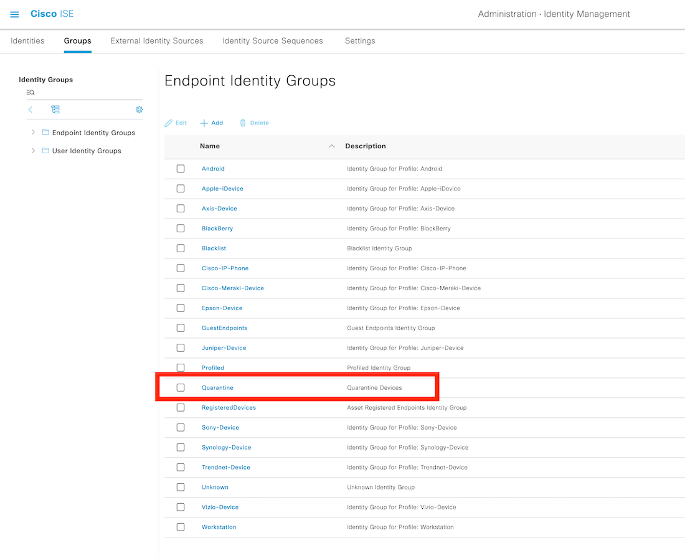
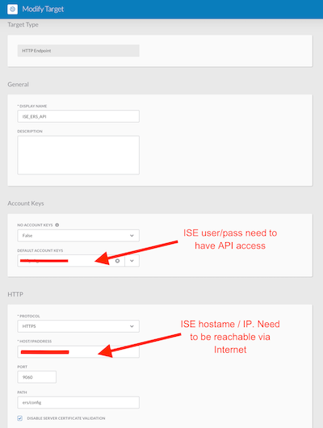

# ISE & Meraki Rapid Threat Containment workflows

Collection of SecureX Workflow and Atomic Activity that initiate a RTC for a MacAddress in a ISE / Meraki infrastructure.

Use cases : 
  - RTC a MacAddress from the CTR plugin
  - RTC a MacAddress from a corrolation workflow as a response to a threat detected.

For any questions or comments/bugs please reach out to me at alexandre@argeris.net or aargeris@cisco.com

 

# Prerequisites:

- Enable ERS API and create an ERS ADMIN API User in ISE save the credential.
https://developer.cisco.com/docs/identity-services-engine/3.0/#!setting-up/cisco-ise

- Create a ISE Authorization Profile.

- Create a Quarantine ISE Identity Endpoint Group

- Create a Quarantine rule in the Global Authorization policy

- Create a Group Policy in Meraki

- Create a TARGET for ISE hostname and credential in SecureX AO

# Import these workflows into SecureX Orchestration as Atomic Actions:
  
- ISE Add Endpoint ID to EndpointGroupID.json
- ISE Get Endpoint Group ID from GroupName.json 
- ISE Get Endpoint ID from MacAdresse.json
- ISE Get Endpoint Info from ID.json
- ISE Quarantine Endpoint.json
- ISE Re_authenticate Endpoint.json

# Main workflows:

- RTC - ISE MacAddress.json

   

# Workflow in action !

- Initiate the worflow from the CTR browser plugin  

 

- ISE logs  

 

- Meraki Client  

 

- FMC

 
